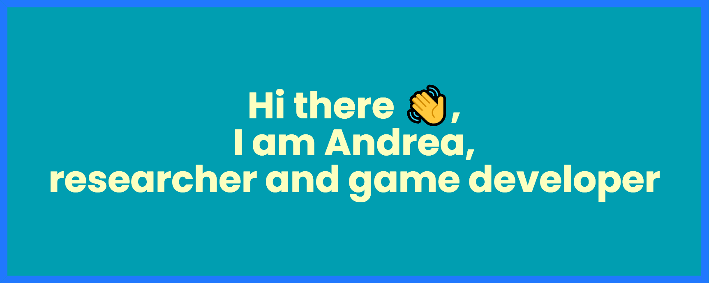

<!-- Adding banner image -->

  

<!--  -->

## About Me:
I am based in London, UK.

- 📚  Leveraging XR technologies, I develop diagnostic tools aimed at the early detection of Alzheimer's disease.
- 💼 I collaborate with game development companies, offering insights grounded in industry expertise.
- 🎓 In my free time, I am learning ✨shaders✨.
<h3>📫 Where to find me</h3>

 

---

  
:zap: GitHub Stats

  

