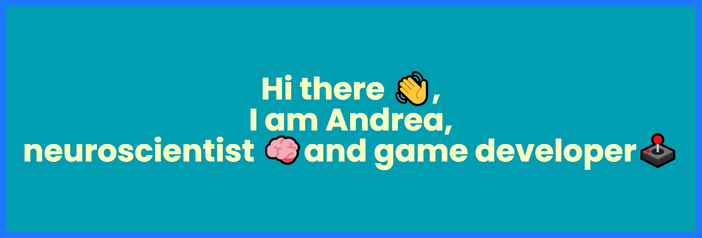

<!-- Adding banner image -->

## About Me:
I am based in London, UK.

- 📚  Leveraging XR technologies, I develop diagnostic tools aimed at the early detection of Alzheimer's disease.
- 💼 I collaborate with game development companies, offering insights grounded in industry expertise.
- 🎓 In my free time, I am learning ✨shaders✨.
<h3>📫 Where to find me</h3>

 

<!--
**Lenakeiz/Lenakeiz** is a ✨ _special_ ✨ repository because its `README.md` (this file) appears on your GitHub profile.

Here are some ideas to get you started:

- 🔭 I’m currently working on ...
- 🌱 I’m currently learning ...
- 👯 I’m looking to collaborate on ...
- 🤔 I’m looking for help with ...
- 💬 Ask me about ...
- 📫 How to reach me: ...
- 😄 Pronouns: ...
- ⚡ Fun fact: ...
-->
